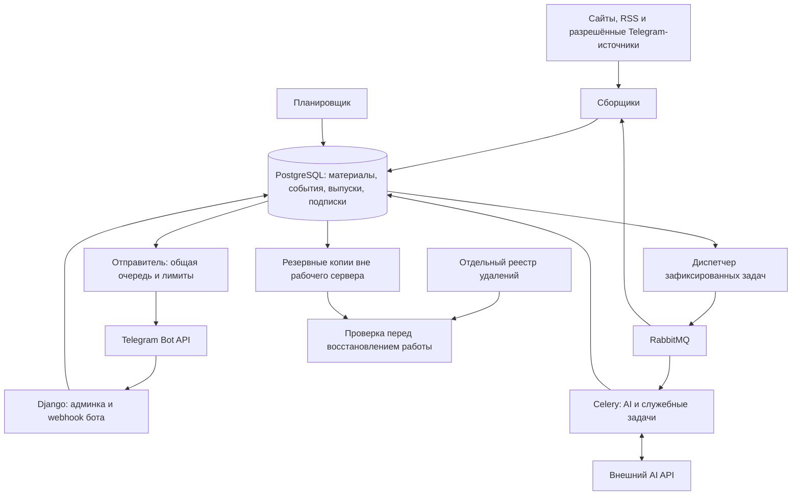

# Техническая архитектура первой версии

Дата: 11 сентября 2026 года. Проектная архитектура полного сервиса. Каталог, расписания и слоты, RSS/HTML-сбор, редакционные версии, AI-шлюз, RU/EN-выпуски, Telegram webhook/очередь и устойчивые фоновые задания работают локально. Реальные внешние вызовы и серверная эксплуатация ещё не проверялись. Основа — [продуктовая спецификация](<C:/Users/Vladislavv/Documents/ChatGPT/AI-дайджесты бот/docs/PRODUCT_SPEC.md>). Инструкция запуска и текущие ограничения находятся в `README.md`.

## Основное решение

Один Python-проект с общей моделью данных и отдельными процессами веб-приложения, фоновой обработки, планирования и отправки. Это позволяет сопровождать один репозиторий и выпускать одну версию приложения, а при росте нагрузки добавлять исполнителей отдельных задач.

Десять текстовых подборок, RU/EN, все три частоты и добавление источников через админку входят в эту архитектуру. YouTube остаётся за пределами первой версии. Рабочие данные, код, домен, серверные аккаунты и доступы принадлежат владельцу сервиса. Внешний AI подключается через заменяемый адаптер.

## Стек

| Часть | Выбор | Причина и граница применения |
|---|---|---|
| Язык | Python 3.13 | Один язык для бота, сбора, обработки и админки |
| Приложение и админка | Django 5.2 LTS, Django ORM, серверные HTML-шаблоны | Авторизация, права, миграции, формы и базовое управление каталогом; редакторские экраны дописываем в том же приложении |
| Telegram-интерфейс | aiogram 3, Bot API | Команды, кнопки, языки, отправка и обработка ошибок Telegram |
| Основная база | PostgreSQL 17 | Транзакции, связи, ограничения уникальности, история и состояние задач |
| Поиск похожих материалов | Расширение pgvector 0.8 в PostgreSQL | Хранение многоязычных векторов рядом с материалами; сходство даёт кандидатов, решение о совпадении события принимается отдельно |
| Фоновые задачи | Celery 5.6 и RabbitMQ 4 | Отдельные очереди сбора, AI и обслуживания; состояние результата сохраняется в наших таблицах PostgreSQL |
| Веб-вход и развёртывание | Caddy 2, Linux, Docker Engine и Compose | HTTPS и воспроизводимое описание процессов, сетей и дисков |
| Файлы и копии | Интерфейс файлового хранилища, отдельное зашифрованное хранилище копий | Для пилота приватный файловый том; место внешних копий выбирается в шаге 2.5 |
| AI | Заменяемый интерфейс и OpenRouter Chat Completions со строгой JSON Schema | Предварительно `openai/gpt-5.4` для RU и `openai/gpt-5-mini` для EN; окончательный выбор и embeddings определяются контрольным сравнением |

Django 5.2 поддерживает Python 3.13 и получает расширенную поддержку до апреля 2028 года. PostgreSQL 17 поддерживается до ноября 2029 года. Это выбор поддерживаемых веток; перед установкой фиксируем актуальные исправления, зависимости и образы в lock-файле и по digest, затем проверяем их совместный запуск. Здесь не зафиксирована проверенная сборка. [Совместимость Django](https://docs.djangoproject.com/en/5.2/faq/install/), [поддержка Django](https://www.djangoproject.com/download/), [поддержка PostgreSQL](https://www.postgresql.org/support/versioning/).

aiogram допускает интеграцию с другим веб-фреймворком. Django admin используем как основу внутреннего управления; предпросмотр выпуска и работу с подтверждениями делаем отдельными Django views. pgvector поддерживает PostgreSQL 13 и новее. [Webhook aiogram](https://docs.aiogram.dev/en/latest/dispatcher/webhook.html#with-using-other-web-framework), [назначение Django admin](https://docs.djangoproject.com/en/5.2/ref/contrib/admin/), [pgvector](https://github.com/pgvector/pgvector).

RabbitMQ входит в список стабильных транспортов Celery. Celery не поддерживает нативный Windows, поэтому рабочее окружение и интеграционные проверки запускаются в Linux-контейнерах; на компьютере владельца возможен WSL2. Установку окружения выполняем на соответствующем шаге. [Транспорты Celery](https://docs.celeryq.dev/en/stable/getting-started/backends-and-brokers/index.html), [платформы Celery](https://docs.celeryq.dev/en/stable/getting-started/introduction.html), [Compose](https://docs.docker.com/compose/).

Для первой версии достаточно этих компонентов: самостоятельные FastAPI, React, Elasticsearch, Redis и отдельная векторная база в схему не входят. Их необходимость можно пересмотреть по измеренному ограничению. Собственное состояние диалогов хранится в PostgreSQL, стандартное хранилище aiogram в памяти для подписок не используется.

## Схема процессов

Процессы используют один образ приложения с разными командами запуска. PostgreSQL хранит устойчивое состояние; сообщение RabbitMQ сообщает исполнителю ID работы. Потеря брокера не должна уничтожать сведения о том, что ещё нужно сделать. Все ответы бота и части дайджестов проходят через общий отправитель и общий лимит Bot API.

## Модули проекта

| Модуль | Ответственность |
|---|---|
| `catalog` | Подборки, профили редакций, источники, связи, фильтры, доступ и правила хранения |
| `ingestion` | Адаптеры источников, курсоры сбора, версии публикаций, ошибки и контроль свежести |
| `editorial` | События, независимое происхождение, утверждения и доказательства, отбор, правки редактора |
| `ai_gateway` | Вызовы провайдеров, схемы ответа, версии инструкций, лимиты, расход и повторы |
| `editions` | Окна, общие карточки событий, тематические выпуски, связанные RU/EN редакции |
| `subscriptions` | Поколения аккаунтов, шесть измерений состояния, настройки и обратная связь |
| `scheduling` | Версии расписаний, слоты, подготовка, задержки и отмена старых заданий |
| `delivery` | Состав пользовательской отправки, части, разрешения, лимиты и результаты Bot API |
| `privacy` | Сроки, очистка, удаление профиля и восстановление с учётом реестра удалений |
| `operations` | Административные роли, задания, аудит, метрики, резервные копии и предупреждения |
| `bot` | Команды, кнопки, перевод интерфейса и вызовы прикладных операций |

Служебные операции вызываются одинаково из бота, админки и фоновых задач. Проверки прав и допустимости перехода находятся в прикладных операциях, а не только в кнопках интерфейса. Изменения опубликованных материалов создают редакцию; прямое редактирование служебного статуса через универсальную форму запрещается.

Предлагаемая структура: `src/digest_service/` с перечисленными модулями, `tests/`, `deploy/`, `docs/` и существующие `config/`, `research/`. Папка `research/` остаётся материалами исследования. Однократный импорт начальных данных сохраняет их стабильные ID и не активирует все источники; повторный запуск приложения не должен перезаписывать настройки, изменённые администратором.

## Как готовится выпуск

1. Сборщик получает только новые публикации или изменённые версии одного источника, даже если он включён в несколько подборок. RSS используется для обнаружения; полный текст извлекается отдельно, когда он нужен и доступен. Храним время публикации, получения, изменения, язык, URL, идентификатор и хеш версии. Курсор продвигается после сохранения результата.
2. Проверки исключают пустой текст, меню сайта, ошибки извлечения и явную рекламу. Страница входа не считается новостной статьёй. Слишком большой материал обрабатывается ограниченными фрагментами с сохранением привязки, без молчаливой потери значимых частей.
3. Точные совпадения, происхождение, временная близость, сущности и многоязычные векторы находят кандидатов на объединение. Совпадение темы или высокая похожесть сами по себе не означают одно событие. Перепечатки и языковые версии одной редакции не дают дополнительных независимых подтверждений.
4. Для события фиксируются существенные утверждения, атрибуция, подтверждающие версии источников и расхождения. AI помогает извлекать и сопоставлять их. Проверка структуры и ссылок выполняется кодом, сомнительные случаи передаются редактору. На пилоте редактор просматривает выпуски.
5. В момент отсечения материалов создаётся снимок кандидатов для окна. Для каждой подборки применяется редакционная политика; отсутствие достаточных новостей — допустимый результат. Контекст может быть старше окна, а поздние материалы рассматриваются в следующем окне с прежними датами.
6. Карточка события готовится общей для выбранного расписания и периода до сборки персональных отправок. RU содержит подтверждённые факты. EN переводит конкретную RU-редакцию. У обеих фиксируются `event_id`, редакция, порядок и ссылки. Изменение RU запрещает отправку прежнего EN до перевода и проверки новой редакции.
7. После проверки фиксируются опубликованные тематические блоки. Отправитель выбирает готовые блоки нужного периода, языка и частоты, удаляет повторные вхождения событий по согласованному приоритету и делит текст на сообщения между историями. Для подписчика новый AI-текст не создаётся.

Постоянная предварительная обработка снижает объём работы в последние 10 минут. Период, язык и параметры отбора входят в ключ переиспользования; недельная карточка не подменяется последней короткой новостью о том же событии. RU/EN могут иметь разное число частей.

Текст источника всегда является данными: он не может менять инструкции AI, запускать инструменты или управлять нашим приложением. AI возвращает проверяемую структуру с ID доказательств; URL подставляются из базы. Результат с неизвестными ID или искажёнными числами не публикуется автоматически. Учёт AI фиксирует задачу, модель, версии инструкций, токены, длительность и расход, без ID подписчиков и полных запросов в логах.

## Контракты и устойчивость задач

Подробные поля, индексы и переходы будут зафиксированы на шаге 2.2. Архитектурные ограничения уже определены:

| Объект | Обязательный ключ или условие |
|---|---|
| Исходная публикация | `source_id + external_id`; отдельные неизменяемые версии текста |
| Слот | `schedule_id + schedule_revision + scheduled_at_utc`; границы окна сохраняются отдельно |
| Тематический выпуск | `collection_id + slot_id + language + revision`; один явный указатель на актуальную опубликованную редакцию |
| Перевод | `ru_revision_id + ru_content_hash`; устаревшая связь блокирует публикацию EN |
| AI-операция | Хеш входных версий, задача, параметры модели, версия инструкции и схемы; подписчик не входит в ключ |
| Автоматическая отправка | `account_generation_id + slot_id + delivery_kind`; новая редакция настроек отменяет ожидающие части, а не создаёт вторую автоматическую рассылку того же слота |
| Часть сообщения | `delivery_id + part_number`; сохраняются хеш текста и полученный `message_id` |
| Команда бота | `bot_id + update_id`; повтор webhook не повторяет прикладную операцию |

Прикладная транзакция сохраняет результат и запись о следующей работе в таблицу исходящих задач — transactional outbox. Диспетчер отправляет её в брокер с подтверждением приёма. Между отправкой и отметкой возможен сбой, поэтому повторное получение задачи ожидаемо: исполнитель проверяет версию объекта и наличие результата. Одного `on_commit` без устойчивой записи недостаточно.

Сообщение брокера содержит только версию контракта и `job_id`; параметры исполнитель читает из PostgreSQL. Целые статьи, отзывы, токены и Telegram-сессии в брокер не передаются. У работ есть срок аренды исполнителем, ограниченное число попыток, время следующей попытки и конечное состояние. Зависшие работы сверяются с базой; после сбоя брокера его очередь восстанавливается из outbox с повторной проверкой результата.

Сетевые операции ограничены тайм-аутами; временные ошибки повторяются с увеличением задержки и разбросом, ошибки доступа и формата требуют другого действия. Позднее подтверждение Celery включается для задач, повторное выполнение которых безопасно. Это соответствует модели повторной доставки Celery, но не даёт гарантии однократного внешнего эффекта. [Модель выполнения Celery](https://docs.celeryq.dev/en/stable/userguide/tasks.html).

Для AI возможен оплаченный ответ, потерянный по сети: перед повтором проверяем состояние запроса у провайдера, если он это поддерживает; иначе повтор ограничивается бюджетом. Атомарное резервирование бюджета до запроса не позволяет параллельным работам многократно превысить установленный лимит.

## Расписание и отправка

Планировщик как отдельная команда приложения проверяет наступающие задания примерно раз в 15 секунд — проектный интервал для измерения. Часы и дни берутся из базы, а не из отдельных системных cron-записей для каждого пользователя. Уникальные ключи слота и задания делают параллельный или повторный проход безопасным; рабочая аренда применяется при выполнении уже созданных заданий.

В базе моменты хранятся в UTC, календарь рассчитывается через `Europe/Moscow`. Сохраняются **10:00 и 19:00 ежедневно; 13:00 ежедневно; понедельник 13:00**. Подготовка по умолчанию начинается за 10 минут. В понедельник в 13:00 суточный и недельный обзоры имеют разные слоты и окна. Пропуск запуска обрабатывается по сохранённой границе и политике опоздания до 60 минут; автоматической рассылки всей накопленной истории нет.

Отправитель запускает рассылку в назначенное время, распределяет части между чатами и сохраняет последовательность внутри каждого чата. Перед каждой частью проверяет поколение аккаунта, текущую редакцию настроек, права, паузу, удаление, состояние расписания и язык. После изменения настроек начатый набор не продолжается с другим составом. Частичная готовность тем показывается явно; поздняя тема не дописывается к уже начатому набору.

Telegram рекомендует не превышать примерно 30 сообщений в секунду для массовой отправки и одно сообщение в секунду в один чат. В проекте начинаем с общего ограничения 25 сообщений/с, из них максимум 20 для дайджестов и 5 для служебных ответов. Это параметры эксперимента, не гарантированная пропускная способность. Ограничение централизовано на одного бота; увеличение числа процессов не увеличивает его. Ответ `429` переносит попытку с учётом `retry_after`. Платная ускоренная рассылка выключена. [Лимиты Telegram](https://core.telegram.org/bots/faq#my-bot-is-hitting-limits-how-do-i-avoid-this).

Для проверки берём консервативный сценарий: все 1000 пользователей получают один слот. Без задержек и повторов время выдачи всех частей не может быть меньше `1000 × среднее число частей / 20` секунд:

| Частей на получателя — допущение | Сообщений | Расчёт при 20 сообщениях/с |
|---|---:|---:|
| 3 | 3000 | 2 минуты 30 секунд |
| 10 | 10000 | 8 минут 20 секунд |
| 30 | 30000 | 25 минут |

Это нижняя расчётная граница, не результат нагрузочного теста. Число частей определяется полными выбранными подборками, их заполненностью, языком и повторами. Около 1000 пользователей в месяц не означает 1000 одновременных получателей; такой пик выбран для проверки запаса. Первая часть и последняя часть выпуска приходят в разное время.

Для `sendMessage` сохраняем HTML и проектный предел 3900 видимых UTF-16 единиц, включая заголовки частей; официальный предел — 4096 символов после разбора сущностей. Если одна история не помещается, общую карточку редактируем и повторно проверяем до публикации. Автоматического обрезания истории или потери ссылок нет. [Формат Bot API](https://core.telegram.org/bots/api#sendmessage).

Отдельное состояние части — `unknown`: запрос мог быть принят Telegram, но ответ потерян, либо процесс завершился после отправки до сохранения `message_id`. По изученному контракту `sendMessage` нет клиентского ключа идемпотентности; из этого следует, что обещать доставку строго один раз нельзя. Автоматический повтор такой части и продолжение её набора приостанавливаются. Администратор видит неопределённый результат и может явно выбрать повтор с риском дубля либо завершение с возможным пропуском. Подтверждённо успешные части не повторяются.

Остановка или удаление запрещают новые попытки. Вызов, уже переданный Telegram до фиксации остановки, нельзя отозвать через отмену локальной очереди; он может завершиться позже. Проверки перед вызовом и короткие тайм-ауты ограничивают это окно, не устраняя его полностью.

## Входящие команды и администрирование

HTTPS webhook проверяет секретный заголовок, размер и тип входа; aiogram разбирает разрешённые сообщения и кнопки. Быстрая операция сохраняет состояние и намерение ответа в транзакции, после чего возвращается успешный HTTP-ответ. AI, получение статей и рассылка не выполняются внутри webhook. Повторный `update_id` не меняет настройки снова; callback связан с владельцем и редакцией экрана. [Проверка webhook](https://core.telegram.org/bots/api#setwebhook).

Полный входящий Telegram JSON обрабатывается в памяти и не сохраняется. В устойчивую запись попадают только поля соответствующей операции; содержание обычного сообщения не логируется, отзыв хранится только в предусмотренном режиме. Реестр обработанных update ID без содержимого хранится 7 дней по правилу завершённых служебных задач. При оформлении удаления состояние `erasure_pending` фиксируется до подтверждения пользователю; повторный `/start` его не отменяет.

| Раздел админки | Что сможет сделать владелец или уполномоченный сотрудник |
|---|---|
| Подборки и источники | Создать тему, добавить разрешённый вход, назначить фильтры, отключить источник, увидеть свежесть и причину ошибки |
| Расписания | Изменить время, дни и будущую дату вступления, добавить поддержанный вариант, увидеть ближайшие пять запусков и затронутые подписки |
| Редакторская работа | Посмотреть источник рядом с утверждением, разделить ошибочно объединённые события, править RU, проверить EN, утвердить или отложить выпуск |
| Отправки | Увидеть готовность, число частей, задержку, неудачные и неопределённые попытки, остановить ожидающие части |
| Пользователи и отзывы | Посмотреть необходимые настройки, обработать отзыв, ограничение и заявку удаления |
| Расходы и эксплуатация | Лимиты AI, расход по этапам, ошибки источников, возраст копии, результат восстановления и очистки |

Предлагаемые роли: владелец с доступами и бюджетами, редактор с правами на содержание, оператор с рассылкой и поддержкой, наблюдатель без изменения данных. Один владелец может совмещать роли. Секреты и Telegram-сессии не показываются в формах или выгрузках; админка хранит ссылки на защищённую конфигурацию. Аудит содержит автора, операцию и редакции без полной копии персонального содержимого. Вход администратора защищается вторым фактором, механизм выбирается при подготовке окружения.

## Источники и внешние границы

Каждый адаптер предоставляет получение новых материалов, продолжение с сохранённого курсора, обработку обновлений и проверку состояния. Поддержанные RSS/HTML/Telegram входы добавляются настройкой; новый неподдержанный способ доступа требует кода адаптера. Произвольные адреса проходят сетевые ограничения: запрещаются внутренние адреса, служебные endpoint и переходы к ним через перенаправления. Cookies и авторизация доступны только нужному сборщику.

Bot API обслуживает пользовательского бота и доставку выпусков. Внутренний сбор публичных каналов выполняет отдельный Telethon-процесс с выделенным аккаунтом, собственным сессионным файлом и административным allowlist. Он не получает личные чаты, контакты, приватные приглашения и результаты глобального поиска.

Условия Telegram ограничивают сбор и использование данных платформы для AI. Владелец проекта уточнил, что сбор является внутренним процессом организации, уже выполняется другой технологией, и организация осознанно принимает платформенный риск. Поэтому риск фиксируется в реестре и эксплуатационной документации, а техническая граница не позволяет расширить сбор за пределы явно активированных публичных каналов. [Условия использования контента](https://telegram.org/tos/content-licensing), [условия API](https://core.telegram.org/api/terms).

Для внешнего AI проверяются возможность обслуживания выбранного региона, обработка новостного контента, языки, хранение данных, стоимость и ограничения запросов. До этого шага конкретную модель не назначаем. При отказе провайдера уже готовые выпуски и настройки остаются доступны; новые сомнительные или неполные результаты не выдаются за проверенный выпуск.

## Развёртывание, хранение и восстановление

В первом тестовом окружении процессы приложения, PostgreSQL и RabbitMQ можно проверить на одном Linux-сервере. Начальная гипотеза для измерения — 4 vCPU, 8 ГБ RAM и 100 ГБ SSD, без GPU, плюс внешние копии. Это не выбранный тариф и не подтверждённая рабочая мощность. Для RabbitMQ официальные рекомендации production предполагают выделенные ресурсы, обычно минимум 4 ядра и 4 ГиБ RAM на узел; совместное размещение в тесте — осознанное ограничение, которое проверяем. До публичного запуска по измерениям выбираем совместное размещение с обоснованием либо отдельный узел брокера/базы. [Рекомендации RabbitMQ](https://www.rabbitmq.com/docs/production-checklist).

Веб-вход доступен по HTTPS через Caddy; база и брокер не публикуют порты в интернет. Linux-окружения разработки, проверки и production имеют разные данные, токены и базы. Домен, поставщик, регион размещения и тариф выбираются в шаге 2.5. Caddy поддерживает автоматическое получение и обновление TLS-сертификатов при подходящих настройках домена и сети. [Caddy HTTPS](https://caddyserver.com/docs/automatic-https).

Политики из `config/data_retention_policy.json` применяются к базе, векторам, файлам, очередям и копиям. Исходные версии и производные фрагменты по умолчанию 90 дней, опубликованные выпуски 365; после очистки текста сохраняются только разрешённые ссылки и метаданные, а отсутствие доказательного текста показывается. Более строгие условия источника имеют приоритет, включая резервные копии.

Заявка удаления получает устойчивую запись в отдельном реестре до сообщения об успешном принятии. Реестр не заменяется старой копией основной базы; при недоступности его записи принятие удаления не объявляется успешным. Заявка применяется к конкретному поколению аккаунта. После рабочей очистки реестр хранится 45 дней, копии — 30 дней; увеличение возраста допустимой копии требует пересчёта запаса реестра.

При восстановлении сначала отключены webhook-операции, AI-работы, планировщик и отправитель. Применяются текущий реестр удалений и сроки всех хранилищ, сверяются неопределённые отправки и старые задачи. Нельзя воспроизвести старую очередь целиком и считать отсутствующий в старой копии `message_id` доказательством недоставки. Неизвестные результаты остаются для разбора; пропущенные слоты подчиняются политике опоздания. Только после этих проверок возобновляется работа. Цели восстановления: потеря до 24 часов данных, восстановление за 4 часа при доступной копии; проверка ещё предстоит.

Наблюдаем возраст последнего успешного сбора по каждому источнику, задержку очередей, время подготовки RU/EN, отклонённые утверждения, токены и расход, результаты частей, ошибки 429, объём базы и срок последней копии. Сбой одного источника не должен останавливать остальные; незавершённая очистка не помечается успешной.

## Результат шага

Зафиксированы стек, границы модулей и процессов, поток материалов, обязательные ключи, общий принцип задач, отправки и восстановления. Совместная локальная сборка, реальные Telegram-источники, OpenRouter и Telegram Bot API проверены; нагрузка и production-окружение ещё не проверены.

Выполнены 22 проверки согласованности документов, начальных настроек, локальных ссылок и арифметики рассылки. [Отчёт](<C:/Users/Vladislavv/Documents/ChatGPT/AI-дайджесты бот/research/architecture_validation.json>) не является испытанием работающего приложения.

Продолжение: реализованы каталог, расписания и слоты, RSS/HTML-сбор, Telethon-адаптер, версии публикаций, события и группировка, тематическая маршрутизация, автоматические RU/EN-карточки и выпуски, подписки, Telegram webhook/polling, доставка, фоновые задания, transactional outbox, роли, копии базы и независимый erasure guard. Живые Telethon, OpenRouter и Telegram Bot API проверены. Целевой Linux/Python 3.13/PostgreSQL/RabbitMQ и нагрузка ещё не проверены. Порядок работы описан в [плане](<C:/Users/Vladislavv/Documents/ChatGPT/AI-дайджесты бот/docs/TECHNICAL_DESIGN_PLAN.md>).
